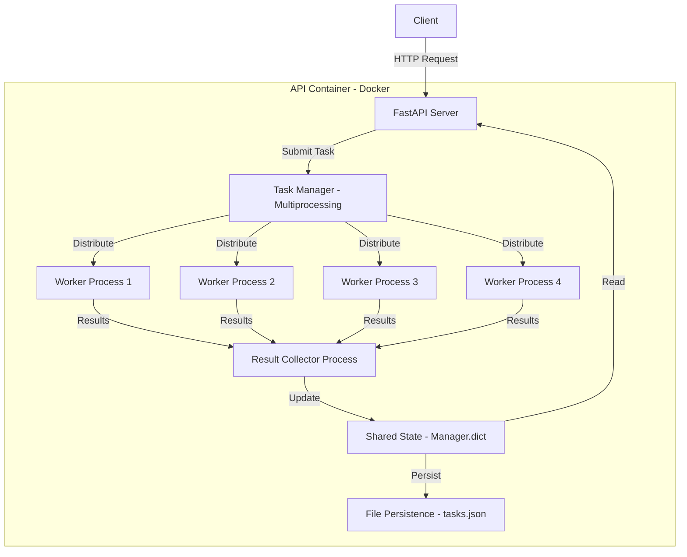

# Quantum Circuit API

An API system for executing quantum circuits asynchronously.

## Overview

This system provides a RESTful API for submitting quantum circuits in QASM3 format and retrieving their execution results.

## Architecture

The system uses a simple, self-contained architecture:

1. **API Server (FastAPI)**: Handles HTTP requests for task submission and retrieval
2. **Task Manager (Multiprocessing)**: Manages worker pool and task distribution
3. **Worker Processes**: Multiple processes execute quantum circuits in parallel
4. **File Persistence (JSON)**: Stores tasks to disk to prevent data loss


Made with Mermaid

## Prerequisites

### For Running Tests
- Python 3.9.x (tested with Python 3.9.6)
- pip

## Quick Start

1. **Clone or extract the project**:
   ```bash
   cd quantum-circuits
   ```

2. **Build and start the service**:
   ```bash
   docker-compose up --build
   ```

3. **Verify the system is running**:
   ```bash
   curl http://localhost:8000/health
   ```

   Expected response:
   ```json
   {
     "status": "healthy"
   }
   ```

## API Endpoints

### POST /tasks

Submit a quantum circuit for asynchronous processing.

**Request Body**:
```json
{
  "qc": "<serialized_quantum_circuit_in_qasm3>"
}
```

**Example Request**:
```bash
curl -X POST http://localhost:8000/tasks \
  -H "Content-Type: application/json" \
  -d '{
    "qc": "OPENQASM 3.0;\ninclude \"stdgates.inc\";\nqubit[2] q;\nbit[2] c;\nh q[0];\ncx q[0], q[1];\nc[0] = measure q[0];\nc[1] = measure q[1];"
  }'
```

**Response** (202 Accepted):
```json
{
  "task_id": "12345-abcde-67890",
  "message": "Task submitted successfully."
}
```

### GET /tasks/{id}

Retrieve the status and result of a submitted task.

**Example Request**:
```bash
curl http://localhost:8000/tasks/12345-abcde-67890
```

**Response - Completed**:
```json
{
  "status": "completed",
  "result": {
    "00": 512,
    "11": 512
  }
}
```

**Response - Pending**:
```json
{
  "status": "pending",
  "message": "Task is still in progress."
}
```

**Response - Not Found**:
```json
{
  "status": "error",
  "message": "Task not found."
}
```

## Running Tests

The project includes comprehensive integration tests that verify the complete workflow: task submission, processing, and result retrieval.

### Prerequisites for Testing

Integration tests run from the **host machine** and make HTTP requests to the containerized API. You need to install test dependencies locally:

```bash
# Create virtual environment with compatible Python version
/usr/bin/python3 -m venv venv  # Uses system Python 3.9 on macOS
# OR
python3.9 -m venv venv         # If you have python3.9 installed
source venv/bin/activate 
pip install -r requirements.txt
```

### Quick Test Run

Use the provided test script that handles API startup/shutdown:

```bash
chmod +x run_tests.sh
./run_tests.sh
```

## Monitoring and Logs

### View logs:
```bash
docker-compose logs -f
```

### View specific container logs:
```bash
docker-compose logs -f api
```

## Stopping the System

```bash
docker-compose down
```

To also remove volumes (including task data):
```bash
docker-compose down -v
```
